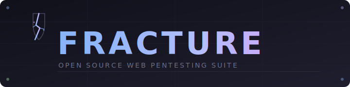

<div align="center">
  
</div>

<br/>

<div align="center">

[](https://python.org)
[](https://pypi.org/project/PyQt6/)
[](LICENSE)
[]()

**Fracture is an open-source, PyQt6-based web pentesting suite.**  
Proxy, intercept, fuzz, scan, track findings, generate payloads — all in one dark-themed desktop app.

</div>

---

## What is Fracture?

Fracture combines three tools into a single, coherent application:

- A **full HTTP/HTTPS intercepting proxy** with repeater, intruder, scanner, decoder, and 30+ supporting tools
- A **findings tracker** with CVSS scoring, session management, and Obsidian-compatible Markdown export
- A **pentest utility belt** — reverse shell generator, hash identifier, payload library, DNS recon, security headers checker, Flask cookie tools, and Werkzeug PIN calculator

Everything runs locally. No cloud, no telemetry, no accounts.

---

## Features

### Proxy & Traffic Analysis
| Tab | Description |
|-----|-------------|
| **Proxy** | Intercept and modify HTTP/HTTPS traffic. Scope filtering, match & replace rules, upstream proxy support, mTLS. |
| **Repeater** | Replay and modify individual requests. Syntax highlighting, history, diff view. |
| **Logger** | Full traffic log with filter, search, and export to JSONL. |
| **Site Map** | Visual tree of all observed hosts and paths. |
| **Inspector** | Request/response detail panel with parameter breakdown. |
| **Comparer** | Byte-level and word-level diff between two requests or responses. |

### Attack
| Tab | Description |
|-----|-------------|
| **Intruder** | Fuzzing engine with multiple attack modes (sniper, battering ram, pitchfork, cluster bomb). |
| **Turbo Intruder** | High-throughput fuzzer for race conditions and large wordlists. |
| **WS Intruder** | WebSocket frame fuzzer. |
| **Sequencer** | Token entropy analysis — test session tokens for predictability. |

### Scanner
| Tab | Description |
|-----|-------------|
| **Passive Scanner** | Analyzes proxied traffic for issues without sending extra requests. |
| **Active Scanner** | Sends crafted probes to detect SQLi, XSS, path traversal, SSRF, and more. |
| **Authz** | Authorization testing — replay requests as different roles, compare responses. |
| **Param Miner** | Discovers hidden parameters in requests. |

### Discovery
| Tab | Description |
|-----|-------------|
| **Spider** | Crawl a target and build a comprehensive site map. |
| **Content Discovery** | Directory and file brute-forcing with custom wordlists. |
| **DNS / Recon** | DNS lookups (A, AAAA, MX, NS, TXT, CNAME, SOA, PTR), WHOIS, and reverse DNS. |

### Auth / Crypto
| Tab | Description |
|-----|-------------|
| **JWT Editor** | Decode, edit, re-sign, and attack JWT tokens (none alg, RS→HS256 confusion, brute-force). |
| **SAML** | Decode and analyze SAML assertions. |
| **GraphQL** | Introspection, query builder, and field fuzzing. |
| **Flask Tools** | Flask session cookie decode / encode / tamper / verify / crack (wordlist). Werkzeug debugger PIN calculator. |

### Tools
| Tab | Description |
|-----|-------------|
| **Decoder** | Encode/decode Base64, URL, HTML, hex, gzip, and more — chainable. |
| **Rev Shell** | Reverse shell generator for 14 languages (bash, python, php, nc, powershell, perl, ruby, socat, go, java, lua, awk, telnet, curl). Listener command included. |
| **Hash ID** | Identifies 30+ hash types with hashcat mode numbers and john formats. Includes a hash calculator. |
| **Payloads** | Searchable library of 100+ attack payloads across SQLi, XSS, LFI, command injection, SSTI, XXE, SSRF, and open redirect. |
| **Sec Headers** | Fetch live headers from a URL or paste raw response — graded report for HSTS, CSP, X-Frame-Options, CORS, Referrer-Policy, Permissions-Policy, Cache-Control, and server banners. |
| **Organizer** | Notes and request organizer for in-session tracking. |
| **Macros** | Session handling macros for authenticated testing flows. |
| **Hackvertor** | Chained encoding/transformation engine. |
| **Hex Editor** | Raw byte-level editor for request/response bodies. |

### OOB & More
| Tab | Description |
|-----|-------------|
| **WebSockets** | Live WebSocket session viewer and injector. |
| **Collaborator** | Out-of-band interaction server for blind SSRF, XSS, and SQLi detection. |
| **Browser** | Embedded Chromium browser with proxy pre-configured. |
| **Session Rules** | Automated session handling rules (token refresh, cookie injection). |
| **Extensions** | Python plugin system — load `.py` files from `~/.fracture/plugins/`. |
| **Cookies** | Persistent cookie jar with scope-aware injection. |

### Findings Tracker
- **Sessions** — organize findings by engagement (target host, date, exec summary, recon notes)
- **Findings** — full structured finding editor: vuln type, target, severity, phase, status, payload, HTTP request/response, screenshots
- **CVSS v3.1 Calculator** — interactive base score calculator with severity auto-assignment
- **Export** — per-finding Markdown, session summary, or full report — Obsidian-compatible

---

## Installation

**Requirements:** Python 3.10+, pip

```bash
git clone https://github.com/Samsong1018/Fracture.git
cd Fracture
pip install -r requirements.txt
```

### Linux

```bash
./run.sh
```

**HTTPS interception — trust the CA cert** (generated on first run at `~/.fracture/ca.crt`):

```bash
# Ubuntu / Debian
sudo cp ~/.fracture/ca.crt /usr/local/share/ca-certificates/fracture-ca.crt
sudo update-ca-certificates

# Arch
sudo trust anchor ~/.fracture/ca.crt
```

Then import the cert into Firefox/Chrome via **Settings → Certificates → Import**.

DNS lookup uses `dig` if installed (`sudo apt install dnsutils`). WHOIS uses `whois` (`sudo apt install whois`). Both fall back gracefully if not present.

---

### macOS

```bash
./run.sh
```

**Trust the CA cert:**

```bash
sudo security add-trusted-cert -d -r trustRoot \
  -k /Library/Keychains/System.keychain ~/.fracture/ca.crt
```

`dig` and `whois` are available by default on macOS. No extra tools needed.

---

### Windows

```bat
run.bat
```

Or: `python main.py`

**Trust the CA cert:**

1. Run `certmgr.msc`
2. Navigate to **Trusted Root Certification Authorities → Certificates**
3. Right-click → **All Tasks → Import**
4. Select `%USERPROFILE%\.fracture\ca.crt`

> **DNS:** `dig` is not available on Windows by default — the DNS tab falls back to Python's socket module automatically, which covers A/AAAA/PTR lookups. For full record types, install [BIND tools for Windows](https://www.isc.org/bind/).
>
> **WHOIS:** Install via `winget install -e --id WiresharkFoundation.Wireshark` (includes whois) or use the online tab as a workaround.

---

## Usage

| Platform | Command |
|----------|---------|
| Linux / macOS | `./run.sh` |
| Windows | `run.bat` or `python main.py` |
| Any | `python3 main.py` |

### Proxy setup

1. Start Fracture and go to the **Proxy** tab
2. The default listener is `127.0.0.1:8080`
3. Configure your browser or tool to use that as its HTTP proxy
4. Traffic appears in the Proxy intercept view and Logger

### Findings workflow

1. Open the **Findings** tab
2. Create a new session (target name + host)
3. Add findings as you work — CVSS score auto-assigns severity
4. Export → Full Report generates an Obsidian-compatible Markdown bundle

### Reverse shell generation

1. Go to **Tools → Rev Shell**
2. Enter your LHOST and LPORT
3. Pick language and variant
4. Copy the shell command, copy the listener command separately

---

## Project Structure

```
Fracture/
├── main.py                    # Entry point
├── run.sh                     # Launch script — Linux/macOS (fixes GTK env issues)
├── run.bat                    # Launch script — Windows
├── requirements.txt
└── fracture/
    ├── gui.py                 # Main window — tab wiring
    ├── proxy.py               # HTTP/HTTPS proxy server
    ├── repeater.py            # Repeater tab
    ├── intruder.py            # Intruder fuzzer
    ├── turbo_intruder.py      # Turbo Intruder
    ├── scanner_passive.py     # Passive scanner
    ├── scanner_active.py      # Active scanner
    ├── decoder.py             # Decoder tab
    ├── jwt_editor.py          # JWT editor
    ├── revshell.py            # Reverse shell generator
    ├── hash_id.py             # Hash identifier + calculator
    ├── payload_lib.py         # Payload library
    ├── dns_recon.py           # DNS / WHOIS recon
    ├── sec_headers.py         # Security headers checker
    ├── flask_tools.py         # Flask cookie + Werkzeug PIN tab
    ├── flask_cookie_logic.py  # Flask cookie logic
    ├── werkzeug_pin_logic.py  # Werkzeug PIN logic
    └── findings/
        ├── tab.py             # Findings tracker tab
        ├── models.py          # Finding / Session dataclasses
        ├── storage.py         # JSON persistence
        └── exporter.py        # Markdown report export
```

---

## Writing a Plugin

Fracture has a Python plugin system. Drop a `.py` file into `~/.fracture/plugins/`:

```python
from fracture.plugins import FracturePlugin

class MyPlugin(FracturePlugin):
    name        = "My Plugin"
    description = "Does something useful"
    version     = "1.0"

    def on_request(self, request):
        request.headers["X-Custom"] = "injected"
        return request

    def on_response(self, response):
        return response
```

---

## Disclaimer

Fracture is intended for **authorized security testing, CTF competitions, and educational use only**.

- Only test systems you own or have explicit written permission to test
- The authors are not responsible for misuse of this tool
- Never use against systems without authorization

---

## License

MIT — see [LICENSE](LICENSE)

---

<div align="center">
  <sub>Built with PyQt6 · Catppuccin Mocha theme · Runs on Linux, macOS, Windows</sub>
</div>
